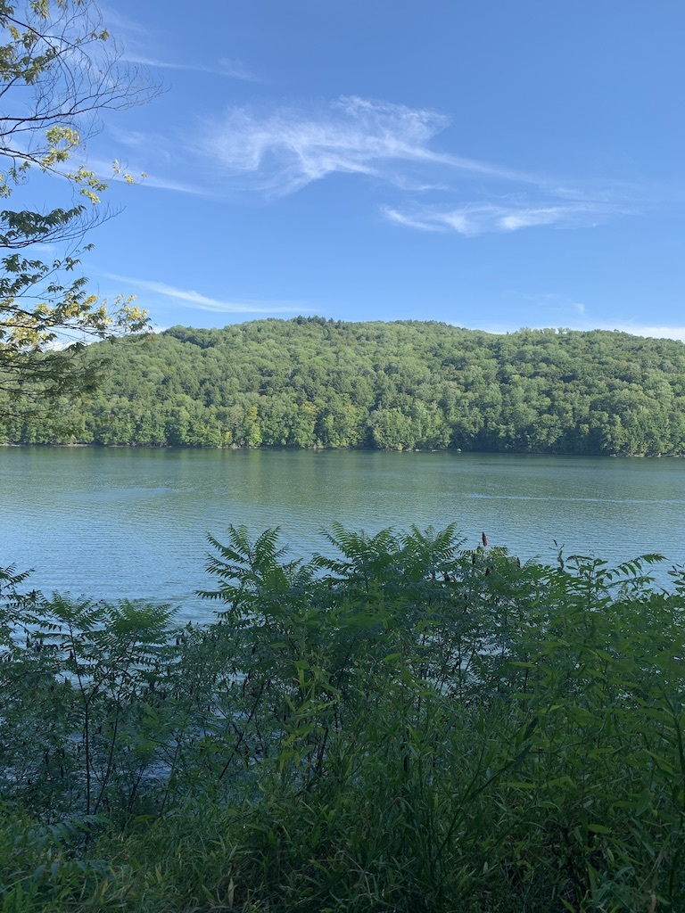
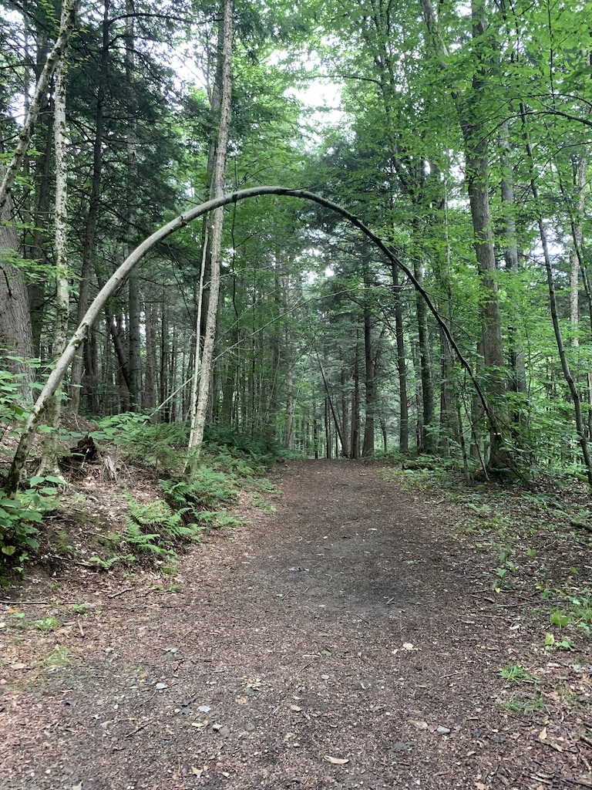
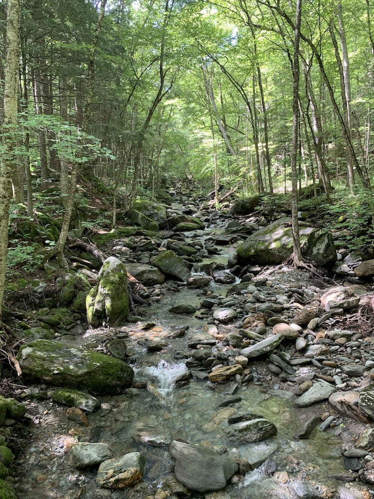
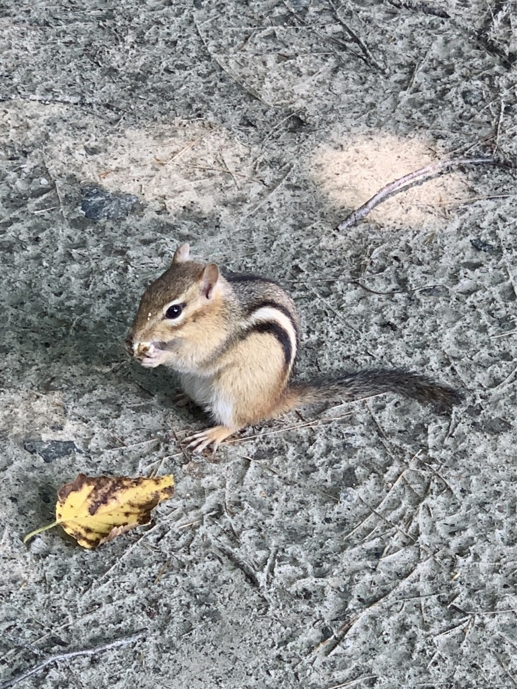

My friend [John](http://branigan.net/) camps yearly at the [Little River State Park](https://vtstateparks.com/littleriver.html) near Waterbury, Vermont. We booked two sites back in September of 2019, intending to camp there together with our partners. He could not join us due to COVID, but my spouse and I decided to go anyway.

Travelling during COVID is stressful. Travelling to Vermont was easier - when we arrived, it was the only "green" state in the US with regards to COVID prevalence. A week of no cell-service, campfires, hikes, starry skies, and the sounds of birds and bugs was just what I needed to recharge and refresh. 

I read two books on the trip, both of which were excellent. [A Field Guide to Getting Lost](https://www.powells.com/book/a-field-guide-to-getting-lost-9780143037248) by Rebecca Solnit, and [The Decipherment of Linear B](https://www.powells.com/book/decipherment-of-linear-b-9780521398305) by John Chadwick. The former is great for campfire musings about the big questions, while the latter is fun if you're into Ancient Greek history and really hard puzzles.

